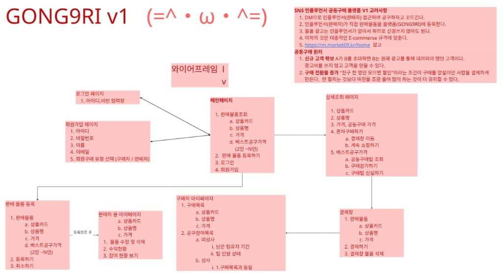
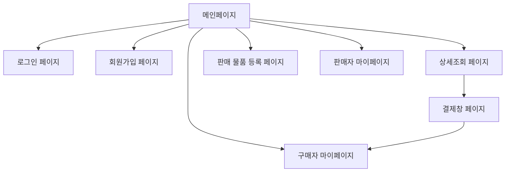

# 📐 GONG9RI v1 와이어프레임 (Wireframe)

SNS 인플루언서 공동구매 플랫폼 **GONG9RI v1**의 와이어프레임 및 화면 흐름도 문서입니다.

---

## 📌 1. 핵심 고려사항 & 공동구매 원리

### 💡 SNS 인플루언서 공동구매 플랫폼 V1 고려사항
1. **DM으로 인플루언서(판매자) 접근**: 공구 제안 및 코드 전달.
2. **판매자가 직접 물품 등록**: 인플루언서가 직접 판매 물품을 플랫폼(GONG9RI)에 등록.
3. **자율적 홍보/광고**: 물품 광고는 인플루언서가 직접 진행하여 플랫폼 측 광고 부담 최소화.
4. **표준 E-commerce 규격**: 이외의 기능은 일반적인 대중적 이커머스 규격 준수.
5. **참고 사이트**: [market09](https://m.market09.kr/home)

### 🤝 공동구매 원리
1. **신규 고객 확보**: 기존 고객 A가 타인 B들을 초대함으로써, 바이럴을 통해 광고비 지출 없이 신규 고객을 유입시킴.
2. **구매 전환율 증가**: "친구 한 명만 모으면 할인" 혜택을 통해 구매를 망설이던 고객의 결제를 유도 (마진 조정 후 수량 증대로 이익 극대화).

---

## 🖥️ 2. 페이지별 구상 및 기능 상세

### 1. 메인 페이지 (`/`)
- **판매 물품 조회**:
  - 상품 카드 (이미지)
  - 상품명
  - 기본 가격
  - 베스트 공구 가격 (2인 ~ N인 할인가)
- **주요 버튼 및 이동 메뉴**:
  - 판매 물품 등록하기
  - 로그인
  - 회원가입

### 2. 로그인 페이지 (`/login`)
- 아이디 / 비밀번호 입력 폼
- 로그인 버튼

### 3. 회원가입 페이지 (`/signup`)
- 회원 정보 입력: 아이디, 비밀번호, 이름, 이메일
- **회원 유형 선택**: `구매자` / `판매자`

### 4. 상세조회 페이지 (`/products/{id}`)
- 상품 카드 및 상품 기본 정보 (상품명, 기본 가격, 공동구매 할인가)
- **혼자 구매하기**:
  - 결제창으로 이동
  - 계속 쇼핑하기
- **베스트 공구 가격 (공동구매 참여/생성)**:
  - 공동구매 팀 조회
  - 기존 팀에 구매 참가하기
  - 신규 구매팀 신설하기

### 5. 결제창 페이지 (`/checkout`)
- 판매 물품 정보 확인 (상품 카드, 상품명, 가격)
- 결제하기
- 결제창 물품 삭제

### 6. 판매 물품 등록 페이지 (`/seller/products/new`)
- 판매 물품 정보 입력: 상품 카드, 상품명, 가격, 베스트 공구 가격 (2인 ~ N인 지정)
- 등록하기 / 취소하기 버튼

### 7. 판매자 마이페이지 (`/seller/mypage`)
- 등록 완료 물품 목록 (상품 카드, 상품명, 가격)
- 물품 수정 및 삭제
- 수익 현황 확인
- 공구 참여 현황 보기

### 8. 구매자 마이페이지 (`/buyer/mypage`)
- **구매 목록**: 구매 완료 상품 카드, 상품명, 가격
- **공구 참여 목록**:
  - **미성사 팀**: 남은 팀 유지 기간, 현재 팀 인원 상태
  - **성사 팀**: 구매 목록과 동일한 주문 상태로 전환
